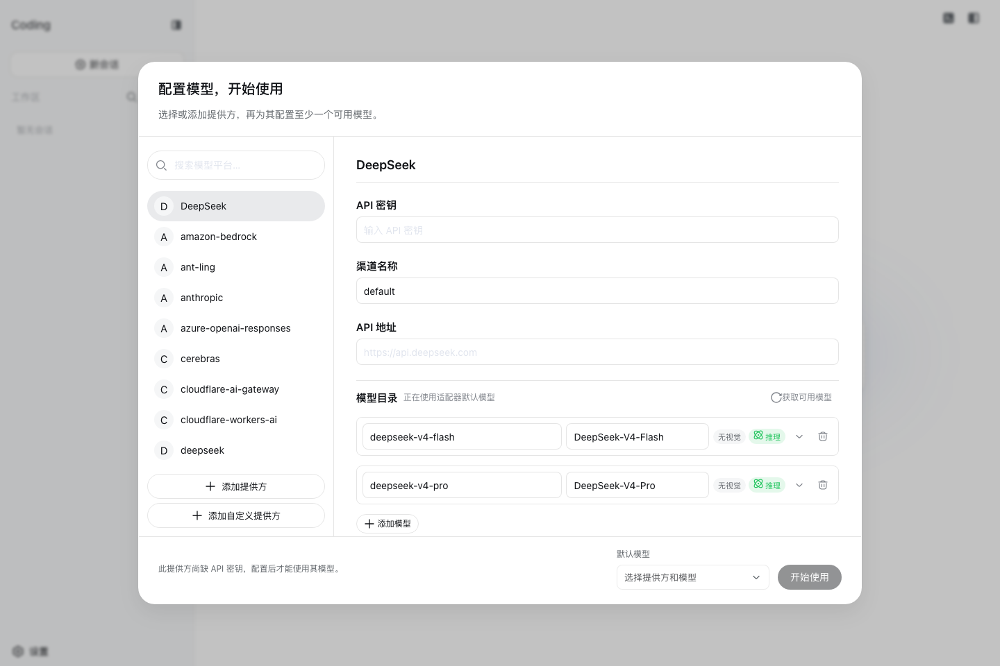
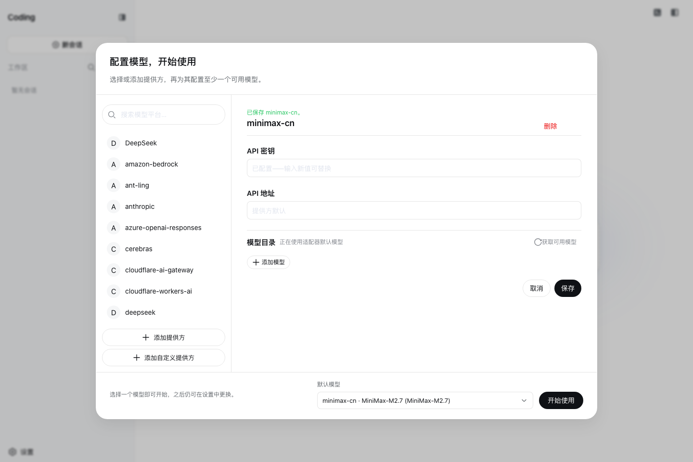
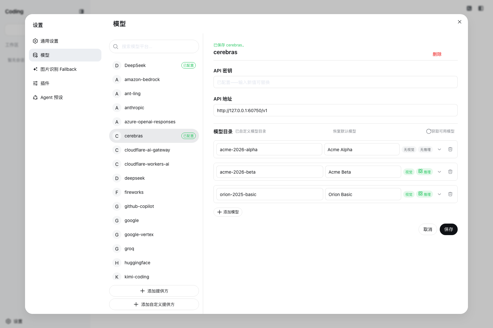
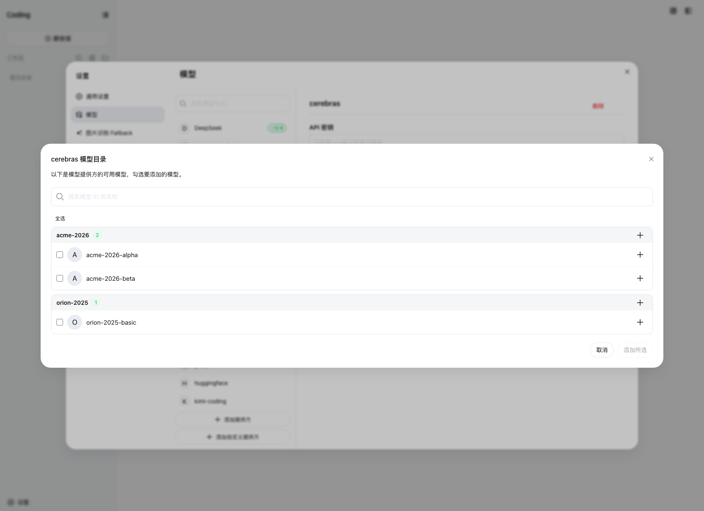
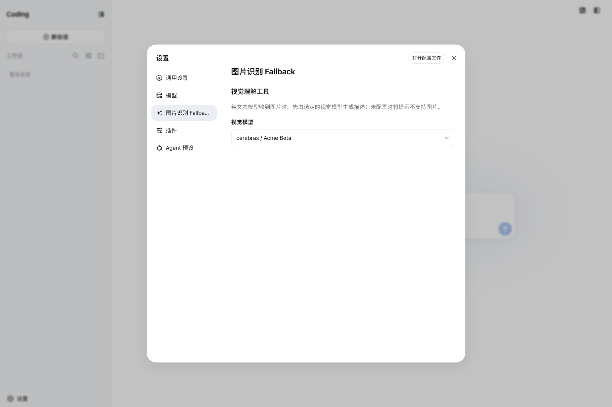

# 配置模型

本指南假定你已按照[根 README](../../../README.md#运行)启动 Web UI。模型变更会在下一次请求时生效，不需要重启服务器。

## 首次配置与默认模型

没有可用默认模型时，欢迎引导直接显示模型配置：左列选择或添加提供方，右列编辑该提供方的凭据、地址与模型。先保存一个可用提供方和至少一个模型，再在引导底部选择默认模型并点击**开始使用**。不能关闭引导直接跳过配置；已有可用默认模型时，引导不会出现。





若没有凭据，填写该提供方的 API 密钥或按其部署方式完成认证；若没有可用模型，在提供方详情中获取或手动添加并保存。目录读取失败时可重试，不能把失败的目录当成空模型列表；提供方或设置不可用、只读时按引导中的诊断修复部署后重试。模型列表的能力声明和密钥是否已保存不等于真实 API 请求已成功验证。

## 配置 DeepSeek

打开**设置 → 模型**，或在首次欢迎引导中选择 DeepSeek。普通设置弹窗左侧是分区导航，模型分区的中列是可搜索的提供方列表，右列是所选提供方详情；窄屏上列表与详情依次呈现，需要时可返回列表。在详情中配置 [DeepSeek API 密钥](https://platform.deepseek.com/)、**渠道名称**和模型并保存。渠道名称默认为 `default`，保存时会去除首尾空格，必须包含非空白字符且最长 64 个字符。



密钥是只写的。保存后，页面只会收到脱敏描述符，永远不会收到明文密钥。密钥存储在 `$DSH_HOME/.credentials.yaml` 中，settings 只保留它的凭据引用。

渠道名称是当前单一 DeepSeek 渠道的持久显示名称，不会创建第二条 DeepSeek 路由。修改它不会改变 `deepseek-official` 模型路由或 API 密钥的凭据引用。

## 添加目录提供方

左侧列出已安装且可配置的渠道；选择 Anthropic 或 OpenAI 等渠道，在右侧详情中填写 API 密钥并保存。已安装目录会提供默认端点、协议和模型列表；如需改用其他端点，可在常显的**API 地址**中填写。密钥只写：已存密钥不会回显，留空表示保持已存值。更改地址后须保存才会用于后续请求。

使用原生认证的提供方需要各自的部署凭据和参数：Bedrock 使用 AWS 凭据与区域，Vertex 使用 ADC 项目，Azure 需要 `api-version`；只填写页面上的 API 密钥字段无法完成这些配置。仅依赖 OAuth 的 Codex 路由目前不在本页可添加的目录中，本页也不提供其登录和凭据刷新流程。

## 添加自定义提供方

对于公司网关、自建服务器或已安装目录中不存在的提供方，选择**添加自定义提供方**。填写以小写字母开头的 Provider ID、API 地址、API 协议和至少一个模型；按端点要求填写密钥，需要其他认证方式时可留空，但仍须在部署侧完成认证，表单不会代办原生登录。创建后在所选渠道详情中继续修改这些配置。

Provider ID 是永久的，因为请求、已保存会话、模型默认值和凭据引用都会使用它。如需重命名提供方，请添加新提供方并删除旧提供方。显示名称、基础 URL、协议、凭据和模型仍可编辑。

## 获取和编辑模型

在**模型目录**中选择**获取可用模型**：DeepSeek 官方渠道，以及使用 `openai-completions` 或 `openai-responses` 协议的渠道，会向当前 API 地址发起实际的模型列表请求；例如草稿地址 `https://gateway.example/v1` 对应 `https://gateway.example/v1/models`。未填写草稿地址时，使用已保存或已安装目录的端点；已安装模型目录只是默认配置，不替代这次网络请求。其他协议不支持此查询，请手动添加模型。请求会使用本次输入的密钥；如果把已保存渠道的地址改成新端点却未输入密钥，查询会在联网前拒绝，不会向新端点发送已存密钥。响应只提供候选模型的 ID、名称和可能的容量，不证明视觉或推理能力。

在候选弹窗中搜索模型 ID 或名称，可以逐项勾选，也可以按模型家族导入；点击**添加所选**或导入家族后，候选才进入当前草稿。已配置的同 ID 模型不会被发现结果覆盖。检查各模型的配置，再保存渠道；只选中或导入而未保存，不会改变可选模型目录。如果端点没有兼容的模型列表接口或查询失败，可直接用**添加模型**手填 ID。



手填或导入的新模型默认声明支持文字和图片；允许推理的渠道默认提供**无／低／高／最高**四档（配置内部依次为 `off`、`low`、`high`、`max`），DeepSeek 渠道若已禁用 thinking 则只有**无**。展开每个模型的设置，可分别调整**视觉**、**推理**和可选档位；不支持图片或推理的端点应先关掉对应能力再保存。已有模型的能力声明不会因打开编辑器而被改写。界面里的声明不是远端验真：模型列表也不会替你判断模态或推理档位，声明错误仍可能在实际请求时被提供方拒绝。

### 图片输入

模型页的**视觉**开关会为该模型声明图片输入。通过界面新建的模型默认开启；如果端点不接受图片，请关闭该模型的开关并保存。直接在 `$DSH_HOME/settings.yaml` 中配置自定义提供方时，可以给模型写入 `input`：

```yaml
llm-pi-ai:
  providers:
    my-gateway:
      apiKeyEnv: GATEWAY_API_KEY
      api: openai-completions
      baseURL: https://gateway.example/v1
      models:
        - id: legacy-chat
        - id: vision-preview
          input: [text, image]
```

`input` 接受 `text` 和 `image`，且只作用于该模型，因此一条路由可以同时服务两类模型。省略它——或写成空列表，两者同义——则保留已安装目录为该模型记录的模态；目录未描述的模型则回退到该路由的 `defaultInput`。

如果你手动录入的模型全都接受图片，可以在路由上设置一次回退值，不必逐个模型写：

```yaml
llm-pi-ai:
  providers:
    vision-gateway:
      apiKeyEnv: GATEWAY_API_KEY
      api: openai-completions
      baseURL: https://vision.example/v1
      defaultInput: [text, image]
      models:
        - id: first-model
        - id: second-model
```

`defaultInput` 是回退值而不是覆盖值，默认为 `[text]`：在目录提供方上，它只为目录未描述的模型作答，因此绝不会把目录中本就具备图片能力的模型的该能力去掉。要收窄这类模型，请用它自己的 `input`。目录提供方没有可供填写的 `models` 列表，因此写在 `modelOverrides` 下，以模型 id 为键：

```yaml
llm-pi-ai:
  providers:
    anthropic:
      modelOverrides:
        claude-sonnet-4-5:
          input: [text]
```

除模型自身的列表外，每个列表都至少要写一项模态；模型自身的空列表与省略它同义。未知模态在任何位置写入都会被拒绝。

这些字段都是对端点能力的声明，而不是检查。声明了端点并不提供的图片能力的模型不会在这里被拦下，改由提供方拒绝该请求。

### 请求兼容性

网关可能持有可用的密钥、地址也通得到，却仍然拒绝每一个请求。pi-ai 依据端点的 URL 决定请求的形状——系统提示词由哪个角色承载、输出上限写在哪个字段、思考级别如何传输——而对于它无法识别的地址，会当作 OpenAI 本身来对待。多数 OpenAI 兼容网关至少会拒绝 OpenAI 所接受的某一样东西。

其中两样占了绝大多数。声明了推理能力的模型，其系统提示词会以 `role: "developer"` 发出，很多网关直接拒绝；输出上限则写作 `max_completion_tokens`，只认 `max_tokens` 的服务端会拒绝。表单里没有这两个字段；请在 `$DSH_HOME/settings.yaml` 的路由上更正：

```yaml
llm-pi-ai:
  providers:
    my-gateway:
      apiKeyEnv: GATEWAY_API_KEY
      api: openai-completions
      baseURL: https://gateway.example/v1
      compat:
        supportsDeveloperRole: false
        maxTokensField: max_tokens
      models:
        - id: my-model
```

路由的 `compat` 是其模型的默认值，模型自身的则逐字段胜出，因此更正某一个模型无需重述整条路由：

```yaml
      models:
        - id: my-model
        - id: my-reasoner
          compat:
            thinkingFormat: deepseek
```

两者都未设置的字段，沿用已安装 catalog 为该模型记录的值；catalog 也未描述的，落到 pi-ai 的检测。凡是写下的开关都要给值：冒号后留空的键（`supportsDeveloperRole:`）会被拒绝而不是被忽略，因为空值会抹掉 catalog 已知的信息，却又没有给出任何替代。任何协议都不接受的名字同样会被拒绝，报错会列出可用的那些。

每个开关归属于声明了它的那些协议，因此在某个 `api` 上合法的开关，在另一个上可能被拒绝——报错会点名该协议实际提供哪些。与上面的 `input` 一样，开关陈述的是关于你的端点的一个断言，而不是对它的检查：设置一个网关其实并不需要的开关，只是发出一个不同的请求而已。

全部开关、各自接受的取值，以及接受它们的协议，都列在[生成的 `dsh-llm-pi-ai` 配置参考](../../config-catalog.md#deepseek-aidsh-llm-pi-ai)的 `PiAiCompatProfile` 之下——该参考派生自源码，因此不会落后于适配器实际接受的内容。

## 选择模型

在对话输入框打开模型选择器，先选渠道，再选该渠道下的模型；进入模型后还可选择该模型公布的推理档位。选择模型也会将其设为新会话的默认值。已发送过请求的会话会保留自身日志中记录的模型。

给纯文本模型发送图片前，打开**设置 → 图片识别 Fallback**，在独立的设置分区中明确选择一条已配置且声明支持视觉的模型路由。图片会先交给该模型生成描述，再供纯文本模型使用；没有选择这条路由时，图片输入会被拒绝，视觉描述失败时也不会发出主模型请求。仅声明支持视觉仍不保证端点实际接受图片。



如果已保存默认值指向不再公布的模型，输入框会显示**选择模型**，可从当前目录重新选择。会话仍能路由但模型不再出现在目录时，提示不等于阻止发送。

## 排错

- **`MISSING_CREDENTIAL`**：通过模型页存储提供方密钥，或提供被引用的环境变量。
- **`UNKNOWN_MODEL`**：选择已配置的模型，或向自定义提供方添加缺失的模型。
- **获取可用模型返回 401**：检查当前渠道的 API 地址及密钥。模型发现会向该地址请求 OpenAI 兼容的 `GET /models`；对于不提供该端点的服务，请手动输入模型。
- **密钥与地址都正确，网关却拒绝每一个请求**：它的请求形状与 OpenAI 不同。先在路由上设 `compat.supportsDeveloperRole: false` 与 `compat.maxTokensField: max_tokens`。
- **只有推理模型失败**：pi-ai 把它们的系统提示词以 `developer` 角色发出，而网关拒绝该角色。设 `compat.supportsDeveloperRole: false`。
- **某个 compat 开关因没有值而被拒绝**：冒号后什么都没写。给它一个值，或删掉该键以沿用已安装 catalog 的值。
- **图片在发送前被拒绝**：若所选模型确实支持图片，在模型详情中开启**视觉**并保存；若它是纯文本模型，请在**设置 → 图片识别 Fallback**中选择另一条已配置且声明支持视觉的路由。未选择工具路由时，纯文本模型不能接收图片。
- **提供方拒绝了带图片的请求**：该模型声明了其端点实际并不提供的图片能力。请从模型的 `input` 或路由的 `defaultInput` 移除 `image`；如需继续在含图会话中使用纯文本模型，须先配置视觉理解工具。原始图片保留在会话日志中，单纯重试同一不支持图片的路由不会消除错误。

## 进阶配置

自动生成的[插件配置目录](../../config-catalog.md)列出每个插件的所有受支持字段与默认值；[`dsh-llm-pi-ai`](../../config-catalog.md#deepseek-aidsh-llm-pi-ai) 就是本页所配置的那个提供方段落。[`dsh-llm-pi-ai`](../../../packages/llm/llm-pi-ai/README.md) 和 [`dsh-llm-deepseek`](../../../packages/llm/llm-deepseek/README.md) 参考文档负责直接 `settings.yaml` 配置、目录解析、推理控制、凭据与适配器错误。
